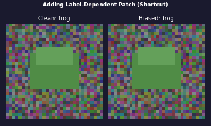
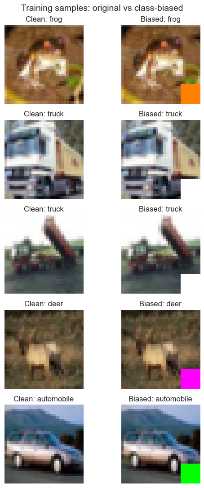
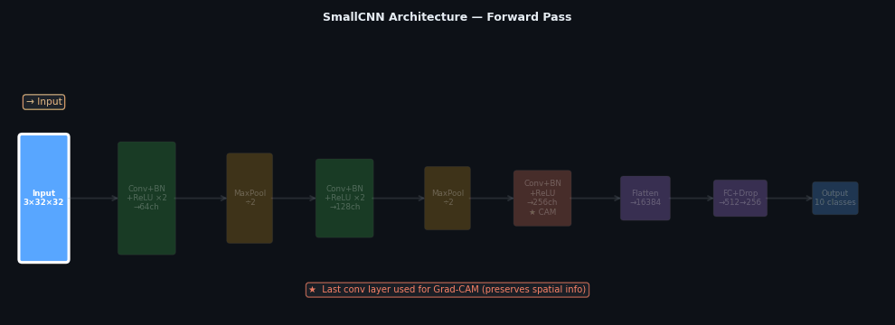
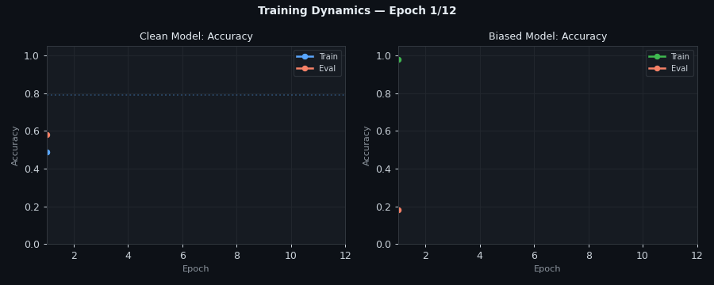
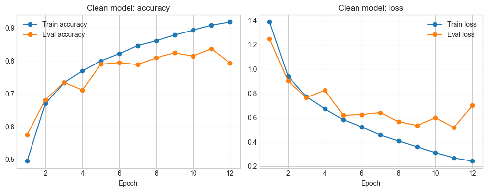
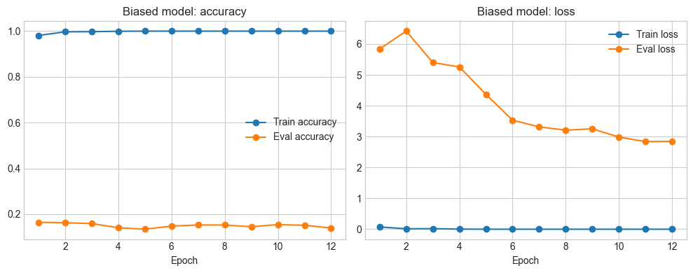
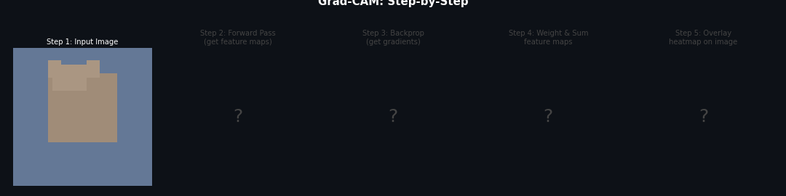
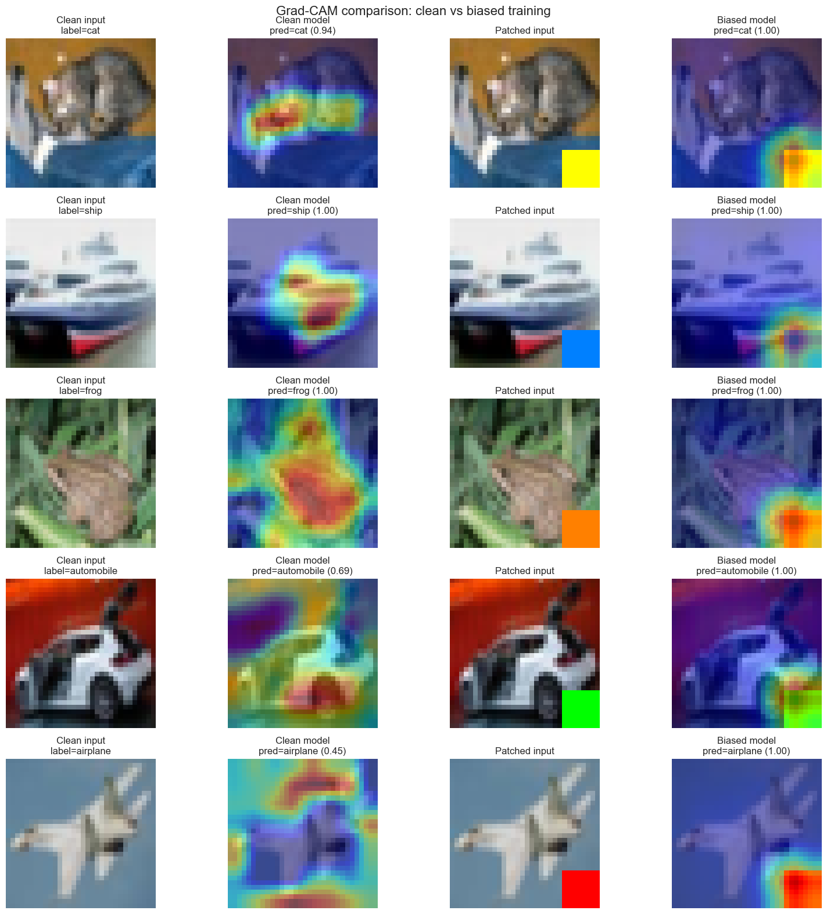
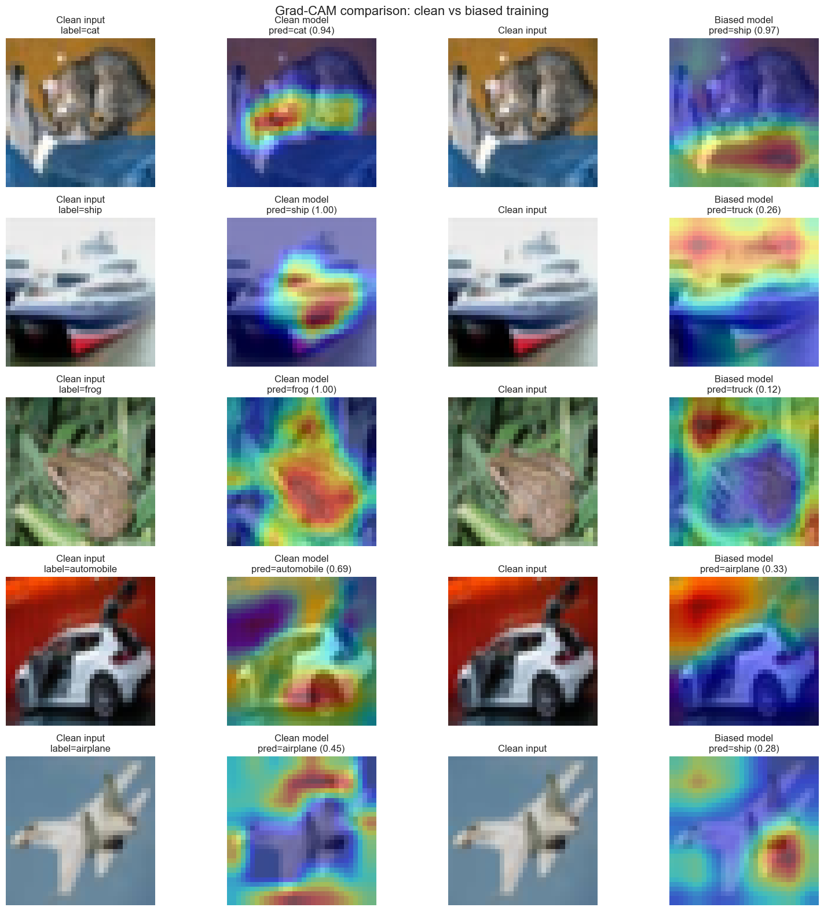
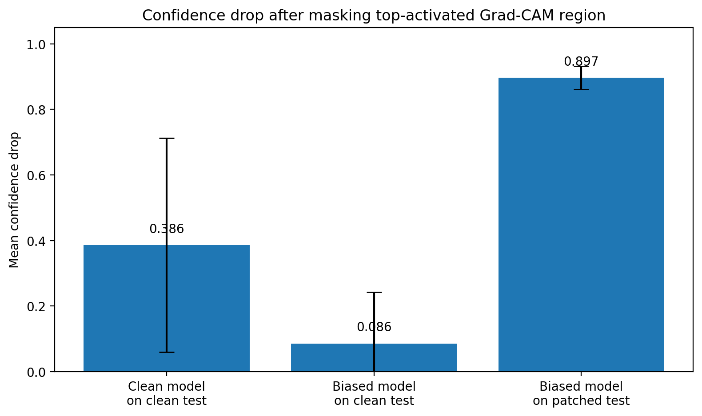

# When Accuracy Lies: Using Grad-CAM to Reveal Shortcut Learning in Image Classification

*A step-by-step case study on how visual explanations expose spurious shortcuts in CNNs trained on CIFAR-10.*

> **Follow along:** [Open in Google Colab](#) 
> **Source paper:** Selvaraju et al., ["Grad-CAM: Visual Explanations from Deep Networks via Gradient-based Localization"](https://arxiv.org/abs/1610.02391), ICCV 2017.

---

## Introduction

Deep learning models can achieve impressive accuracy — and still fail in a crucial way.

They can solve tasks **for the wrong reasons**.

In many real-world applications, knowing that a model is correct is not enough. We also need to understand:

- *What features did the model rely on?*
- *Is the reasoning robust or fragile?*
- *Would the model fail if conditions slightly change?*

This is where **Explainable AI (XAI)** becomes essential. Without it, a 100%-accurate model on a benchmark can be completely useless — or dangerous — in production.

In this tutorial, we build a **controlled experiment** to answer these questions head-on. We train two convolutional neural networks on CIFAR-10:

- a **clean model** trained on original images
- a **shortcut-biased model** trained on images with a label-dependent colored patch

We then use **Grad-CAM** to visualize how each model makes decisions — and demonstrate, quantitatively and visually, how shortcut learning fundamentally changes model behavior.

---

## What is Shortcut Learning?

Shortcut learning occurs when a model relies on **simple spurious correlations** in the training data instead of meaningful semantic features.

Instead of learning *what an object is*, the model learns *what correlates with the label*.

Classic real-world examples:

| Domain | Shortcut | What the model ignores |
|---|---|---|
| Medical imaging | Hospital watermarks on X-rays | Pathology itself |
| Object detection | Objects always on white background | Object shape |
| Autonomous driving | Road color in training region | Road geometry |

These shortcuts often go undetected **until the model hits a distribution shift** — when images come from a different hospital, camera, or lighting condition.

---

## Experimental Setup

To study shortcut learning in a fully controlled way, **we create the shortcut ourselves**.

We modify CIFAR-10 by overlaying a small colored square patch:

- Each of the 10 classes gets a unique patch color
- The patch is placed at a fixed location (bottom-right corner)
- The color is perfectly correlated with the class label

This makes the shortcut:

- **Easy to detect** visually
- **Perfectly predictive** — the model can achieve 100% accuracy using only the patch
- **Completely non-semantic** — it carries zero information about the actual object



**Figure 1.** A label-dependent colored patch is added to the bottom-right corner of each image. The biased model can solve the task just by memorizing the patch color.

---

## Dataset Examples



**Figure 2.** Clean vs. biased training samples. Each class gets a unique color: orange for frog, white for truck, magenta for deer, green for automobile, etc. The patch itself tells a model everything it needs — without looking at the actual image content.

---

## Model Architecture

We use a compact CNN to keep the experiment interpretable and fast to train.

The model consists of five convolutional blocks (with batch normalization and ReLU activations) followed by max pooling and a three-layer fully connected classifier.



**Figure 3.** Forward pass through SmallCNN. The last convolutional layer (marked ★) is used for Grad-CAM because it is the final layer that still retains spatial information — after flattening, all spatial structure is lost.

The architecture in detail:

```
features:
  Conv2d(3, 32, 3)  → BN → ReLU
  Conv2d(32, 64, 3) → BN → ReLU
  MaxPool2d(2)
  Conv2d(64, 128, 3)  → BN → ReLU
  Conv2d(128, 128, 3) → BN → ReLU
  MaxPool2d(2)
  Conv2d(128, 256, 3) → BN → ReLU   ← Grad-CAM target layer

classifier:
  Flatten → Linear(16384, 512) → ReLU → Dropout(0.35)
           → Linear(512, 256)  → ReLU → Dropout(0.20)
           → Linear(256, 10)
```

Formally, the model computes:

$$
z = f_\theta(x), \quad p(y = c \mid x) = \text{softmax}(z)_c, \quad \mathcal{L} = -\log p(y \mid x)
$$

Both the clean and biased models share this identical architecture. The only difference is the training data.

---

## Training Setup

Two models are trained for 12 epochs with Adam (lr=1e-3, weight_decay=1e-4):

**Clean model** — trained on original CIFAR-10 images. Must learn semantic features (shapes, textures, colors of objects) to classify correctly.

**Shortcut-biased model** — trained on patched images. Has access to a perfect 1-feature classifier (the patch color) that requires no understanding of the actual object.

---

## Results: Accuracy Can Be Deeply Misleading

| Model | Test Data | Accuracy | Loss |
|---|---|---|---|
| Clean model | Clean test | **0.7925** | 0.6993 |
| Biased model | Clean test | 0.1393 | 2.8454 |
| Biased model | **Patched** test | **1.0000** | 0.0000 |

The biased model is simultaneously:
- **Perfect** — when the shortcut is present (100% accuracy)
- **Broken** — without the shortcut (13.9% ≈ random for 10 classes)

If you only evaluated this model on a patched test set — which matches the training distribution — you would ship a completely useless model thinking it's perfect.

---

## Training Dynamics



**Figure 4.** Epoch-by-epoch accuracy curves. The clean model learns gradually and generalizes with a reasonable train/eval gap. The biased model reaches ~99% train accuracy by epoch 1 (it memorized the patch immediately) while eval accuracy stagnates at ~14% — it has no ability to generalize to clean images.

### Clean Model



**Figure 5.** The clean model shows healthy learning dynamics: train and eval curves track together, with gradual improvement across epochs.

### Shortcut-Biased Model



**Figure 6.** The biased model's behavior is a warning sign: train accuracy jumps to ~1.0 immediately while eval loss diverges rapidly. The model has learned nothing useful — it has only memorized the patch.

---

## Grad-CAM: How It Works

Grad-CAM (Gradient-weighted Class Activation Mapping) explains CNN predictions by highlighting image regions that most influenced the decision. It does this entirely through **gradient information** — no architectural changes needed.



**Figure 7.** Grad-CAM computes its explanation in five steps: take the input → run a forward pass to get feature maps → backpropagate to get gradients at the target layer → average gradients per channel as importance weights → weighted-sum the feature maps and apply ReLU.

### The Math

For a target class $c$ and the last convolutional layer with $K$ feature maps $A^k \in \mathbb{R}^{H \times W}$:

**Step 1 — Compute importance weights** by globally average-pooling the gradients of the class score $y^c$ with respect to each feature map:

$$
\alpha_k^c = \frac{1}{Z} \sum_i \sum_j \frac{\partial y^c}{\partial A^k_{ij}}
$$

**Step 2 — Compute the CAM** as a ReLU-activated weighted sum of feature maps:

$$
L^c = \text{ReLU}\!\left(\sum_k \alpha_k^c A^k\right)
$$

The ReLU ensures we only keep activations that **positively** influence the predicted class. The result is upsampled to input resolution and overlaid as a heatmap.

### Why the last conv layer?

It's the final layer that still retains **spatial structure** — every earlier spatial pattern is encoded there. After global pooling and flattening, that information is irreversibly lost.

### Implementation

We implement Grad-CAM **manually** using PyTorch hooks — no third-party library:

```python
class GradCAM:
    def __init__(self, model, target_layer):
        self.activations = None
        self.gradients = None
        # Hook to capture forward activations
        target_layer.register_forward_hook(self._forward_hook)
        # Hook to capture backward gradients
        target_layer.register_full_backward_hook(self._backward_hook)

    def _forward_hook(self, module, inputs, output):
        self.activations = output.detach()

    def _backward_hook(self, module, grad_input, grad_output):
        self.gradients = grad_output[0].detach()

    def __call__(self, input_tensor, target_class=None):
        logits = self.model(input_tensor)
        if target_class is None:
            target_class = logits.argmax(dim=1).item()

        # Backpropagate the score for the target class
        logits[:, target_class].sum().backward(retain_graph=True)

        # Average gradients over spatial dimensions → channel importance weights
        weights = self.gradients.mean(dim=(2, 3), keepdim=True)  # α_k^c

        # Weighted sum of feature maps + ReLU
        cam = F.relu((weights * self.activations).sum(dim=1, keepdim=True))

        # Upsample to input size and normalize to [0, 1]
        cam = F.interpolate(cam, size=input_tensor.shape[-2:], mode='bilinear')
        cam = (cam - cam.min()) / (cam.max() + 1e-8)
        return cam.squeeze().detach().cpu().numpy()
```

**Key insight:** The hook mechanism is non-invasive — you attach it to any layer of any model without changing the architecture or training code.

---

## Grad-CAM Results

### Biased Model — With the Shortcut Patch



**Figure 8.** When given a patched image, the biased model confidently predicts the correct class (confidence=1.00) — but the Grad-CAM heatmap reveals it is **looking almost exclusively at the patch**, not the object. The cat, ship, frog, and airplane are invisible to this model's reasoning.

### Biased Model — Without the Shortcut Patch



**Figure 9.** Without the patch, the biased model **loses its footing completely**. It predicts wrong classes with low confidence, and the attention maps become scattered and incoherent — the model has no learned features to fall back on. A cat is predicted as a ship (0.97); a frog becomes a truck (0.12).

The clean model, by contrast, produces focused, semantically meaningful heatmaps in both conditions — it consistently attends to the actual object.

---

## Confidence Drop: Quantifying Explanation Quality

Visual inspection is compelling, but we also validate explanations **quantitatively** with a simple diagnostic:

1. Compute Grad-CAM for the predicted class
2. Zero out the top 20% most-activated pixels (the region the model "looks at")
3. Measure how much the model's confidence in its prediction drops

The intuition: if the highlighted region genuinely drives the prediction, removing it should cause a large confidence collapse.

```python
def confidence_drop_score(model, cam_extractor, dataset, top_fraction=0.2):
    drops = []
    for image, _ in dataset:
        input_tensor = image.unsqueeze(0).to(device)

        # Original confidence
        probs = softmax(model(input_tensor))
        pred_class = probs.argmax().item()
        original_conf = probs[0, pred_class].item()

        # Compute CAM and mask top-activated region
        cam_map = cam_extractor(input_tensor, target_class=pred_class)
        threshold = np.quantile(cam_map, 1.0 - top_fraction)
        mask = torch.from_numpy((cam_map >= threshold).astype(np.float32))
        masked_input = input_tensor * (1.0 - mask)

        # Confidence after masking
        masked_conf = softmax(model(masked_input))[0, pred_class].item()
        drops.append(original_conf - masked_conf)

    return {"mean_drop": np.mean(drops), "std": np.std(drops)}
```

---

## Confidence Drop Results



| Condition | Mean Drop | Std |
|---|---|---|
| Clean model on clean test | 0.386 | 0.326 |
| Biased model on clean test | 0.086 | 0.157 |
| Biased model on patched test | **0.897** | 0.035 |

The numbers tell the same story as the heatmaps, but now in hard metrics:

- **Clean model (0.386):** Masking the attended region causes a meaningful confidence drop — the model is genuinely using the regions it highlights. High variance (0.326) reflects that some images are harder than others.

- **Biased model on clean test (0.086):** Almost no drop. The model has no coherent attended region to mask because it has no coherent strategy for clean images — its attention is scattered noise.

- **Biased model on patched test (0.897):** The single largest and most consistent drop (std=0.035). Masking the patch region destroys the model's prediction almost entirely. This is direct, measurable evidence that the model's entire decision is the patch.

> **The explanation is not just visual — it reflects real, causal model behavior.**

---

## Discussion

This experiment reveals a fundamental and dangerous failure mode in ML:

> A model can be right for the wrong reason — and standard evaluation won't catch it.

The biased model achieves perfect accuracy under normal deployment conditions (patched images = training distribution). Only when we use Grad-CAM do we see that the model has learned nothing about frogs, ships, or automobiles — it has learned only to look at the corner of the image.

**Three lessons:**

1. **Test set distribution matters critically.** If your test set shares the shortcut with your training set, your metrics are meaningless.

2. **Grad-CAM makes shortcuts visible.** Before the heatmaps, the biased model looked better than the clean model on its test set. After them, the situation is obvious.

3. **Confidence drop makes it measurable.** You don't need to look at every image manually — the confidence drop metric gives you a scalar signal that scales to large evaluation sets.

---

## Limitations

- **CIFAR-10 resolution (32×32) produces coarse heatmaps.** Grad-CAM resolution is tied to the last conv layer's spatial dimensions — 8×8 before upsampling. This is a fundamental limitation, not a bug. Larger images give sharper CAMs.

- **The shortcut is synthetic and obvious.** Real-world shortcuts (background statistics, image compression artifacts, demographic proxies in medical data) are far harder to detect and control.

- **Grad-CAM is not causal proof.** It shows which regions have strong gradient signal, not necessarily which regions are *necessary and sufficient* for the prediction. The confidence drop experiment provides a complementary causal check.

- **Grad-CAM is CNN-specific.** It requires spatial feature maps. For transformer-based vision models (ViT, CLIP), you need alternatives like Attention Rollout or GradCAM++ adapted for attention heads.

- **Masking with zeros is out-of-distribution.** The confidence drop experiment zeroes out pixels, but real images never have large black patches. Replacing with the dataset mean would be more methodologically sound — though the qualitative conclusions remain the same.

---

## Conclusion

This case study demonstrates three things you should take into every ML project:

1. **Accuracy alone is not enough.** A model can be perfect on paper and useless (or dangerous) in production.

2. **Shortcut learning is the default**, not the exception. Models are empirical risk minimizers — they will always exploit any correlation that lowers loss, regardless of whether it's meaningful.

3. **XAI is essential for trust.** Grad-CAM turns the black box into something inspectable. Combined with quantitative diagnostics like confidence drop, it gives you a systematic way to verify that your model is reasoning correctly before deployment.

> **Accuracy can hide brittle reasoning — but explanations can expose it.**

---

## Reproducibility

| Component | Details |
|---|---|
| Framework | PyTorch |
| Dataset | CIFAR-10 (standard splits) |
| Architecture | SmallCNN (custom, ~2.5M params) |
| Grad-CAM | Manual implementation via hooks |
| Seed | Fixed (42) throughout |
| Training | Adam, lr=1e-3, wd=1e-4, 12 epochs |
| Colab | [Open Notebook](#) *(ссылка будет здесь)* |

All experiments are fully reproducible from the provided notebook. The `Config` dataclass exposes all hyperparameters as environment variables, so you can override any setting without editing code:

```bash
EPOCHS=20 PATCH_SIZE=4 python train.py
```

---

## References

1. Selvaraju, R. R., Cogswell, M., Das, A., Vedantam, R., Parikh, D., & Batra, D. (2017). **Grad-CAM: Visual Explanations from Deep Networks via Gradient-based Localization.** *ICCV 2017.* [arXiv:1610.02391](https://arxiv.org/abs/1610.02391)

2. Geirhos, R., Jacobsen, J. H., Michaelis, C., Zeiler, M., Brendel, W., Bethge, M., & Wichmann, F. A. (2020). **Shortcut Learning in Deep Neural Networks.** *Nature Machine Intelligence.* [arXiv:2004.07780](https://arxiv.org/abs/2004.07780)

3. Krizhevsky, A. (2009). **Learning Multiple Layers of Features from Tiny Images.** Technical Report, University of Toronto. *(CIFAR-10 dataset)*
